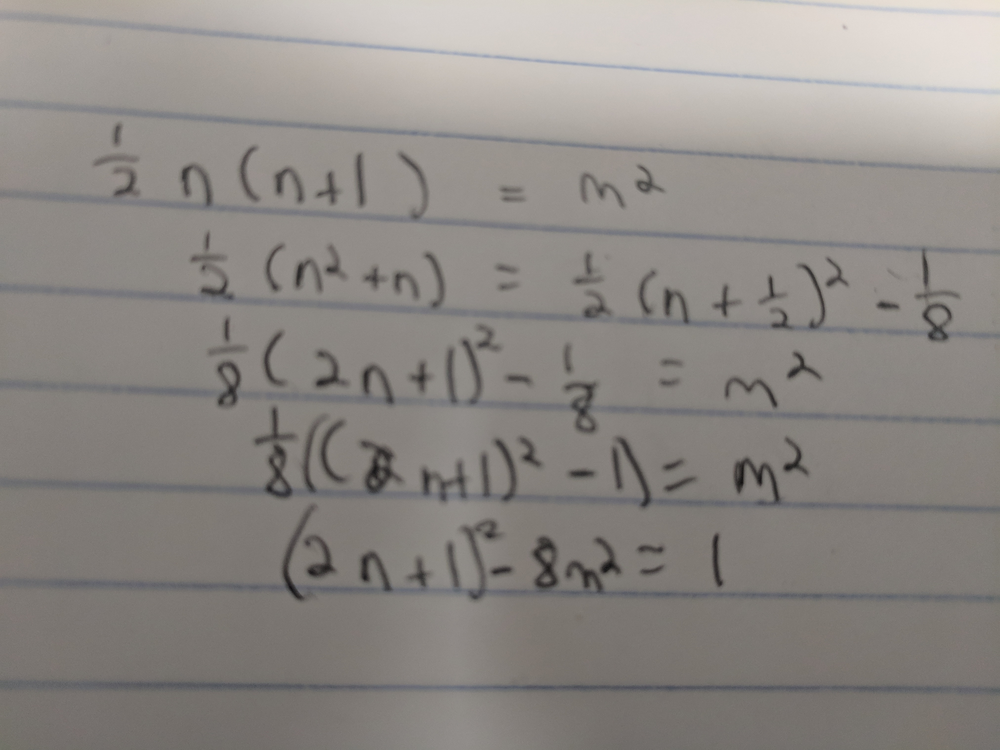
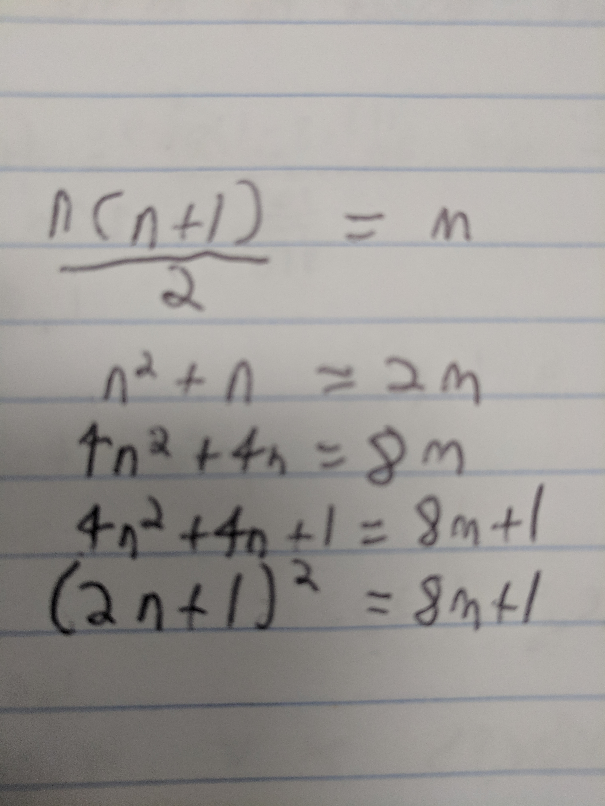
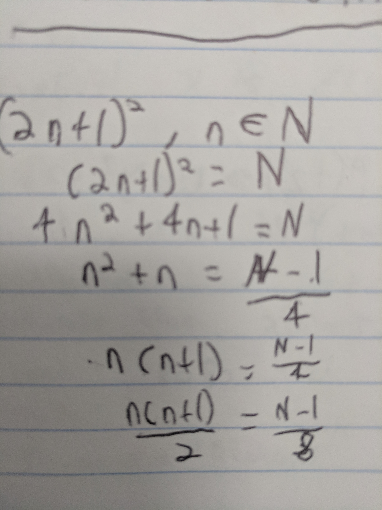

# Exercises 1.1, 1.2, 1.6

## 1.1. The first two numbers that are both squares and triangles are 1 and 36. Find the next one and, if possible, the one after that. Can you figure out an efficient way to find triangular-square numbers? Do you think that there are infinitely many?

 A not so efficent way would be to compute this by making a dictionary of triangle and sqare numbers and then cross referencing them. 

 A more efficient way would be to set the equations for both finding the nth triangle and the nth square equal to each other and finding values that satisfy both equations when 

 the formula mentioned in the book for finding the nth triangular number is $\frac{(n(n+1))}{2}$. For finding the mth square it is simply $m^2$
 
 so in order to find numbers to meet both criteria set both of them equal to each other.
 
 $\frac{(n(n+1))}{2}=m^2$
 
 then complete the square

  

if we let $x=2n+1$ & $y=2m$, then:

we have pells equation:

$x^2-2y^2=1$

the first few solutions to this are (3,2),(17,21),(99,70)
and the next two numbers in the sequence are 1225 and 41616

note: I looked that last part up, but aside from brute forcing it I wasn't sure how to actually go about solving for the values. 

Yes there would be infinitely many triangle and square numbers because there would be infinitely many solutions to the above equation. 

## 1.2. Try adding up the first few odd numbers and see if the numbers you get satisfy some sort of pattern. Once you find the pattern, express it as a formula. Give a geometric verification that formula is correct.

they are the consequtive square numbers. 

I actually accidently solved this one while looking for a pattern to generate the every number leading to the nth square number. you can find the code here:

https://github.com/skewballfox/number_theory_playground/blob/master/number_theory_functions.py

## 1.6. For each of the following statements, fill in the blank with an easy-to-checkcriterion:

### (a) M is a triangular number if and only if **_8M+1_** is an odd square.
let M be a trianglular number, 
by definition of odd an odd square is in the form is $(2n+1)^2$

### (b) N is an odd square if and only if **_(N-1)/8_** is a triangular number.
let N be an odd square, 
by definition a triangular number matches the form $\frac{(n(n+1))}{2}$

### (c) Prove that your criteria in (a) and (b) are correct.
I proved that the equations for both fit the form for it's partner equation in part **a** and **b**